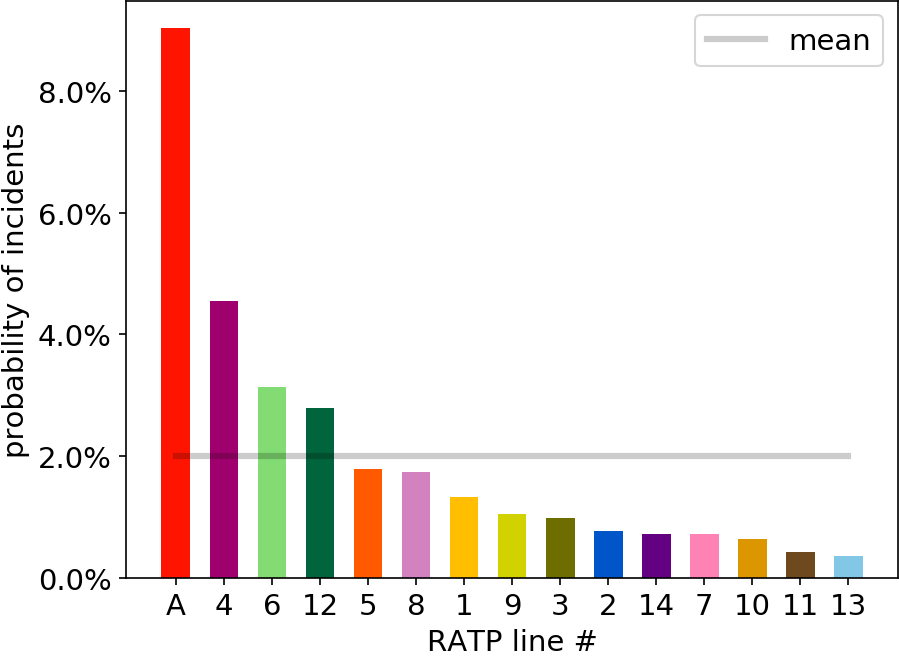
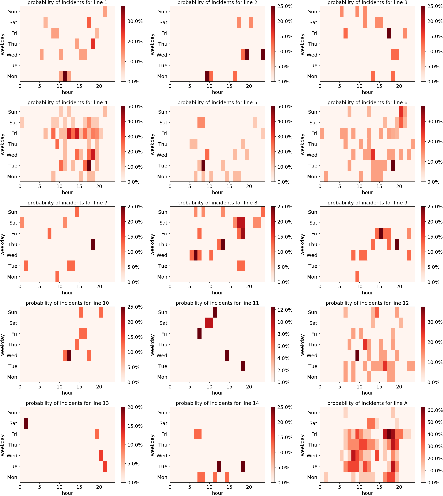

Incident analysis of Paris RATP metro lines
===========================================

This library can be used to generate following figures illustrating the probability of incidents for each Paris metro/RER line during the last 30 days.

Which line is more probable to make you angry?
----------------------------------------------

When (at which hour and on which day) should you avoid metros?
--------------------------------------------------------------

API documentation
==================

.. automodule:: ratpmetro
   :members:

.. toctree::
   :maxdepth: 2

Indices and tables
==================

* :ref:`genindex`
* :ref:`modindex`
* :ref:`search`
